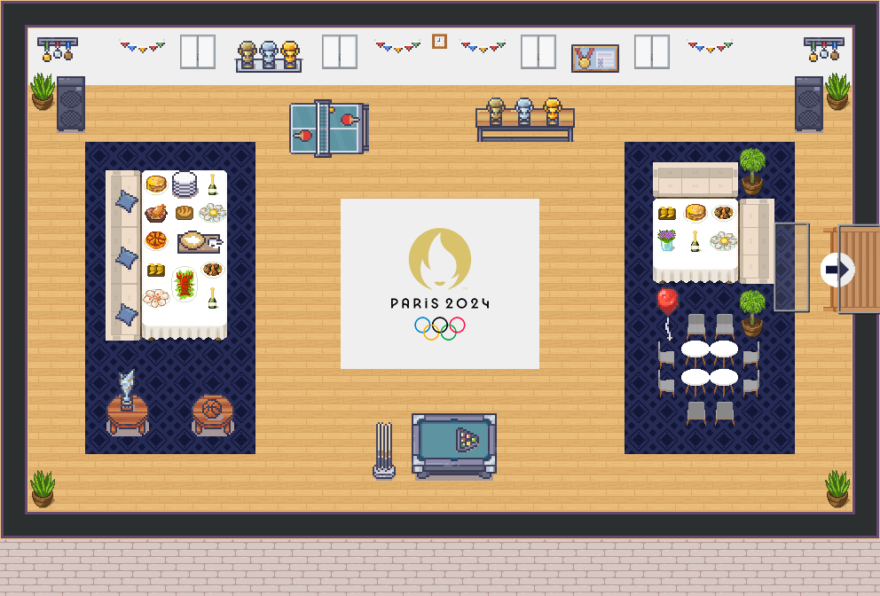

# Hackaton 2024 - Olympic Games



The Olympic Games project is designed to allow watching the Olympics or any sports event with a community that shares the same interests. Each sport or match has its designated room, and each room is displayed dynamically based on the competition day. This setup ensures that participants can easily find and join the appropriate room for live events, fostering a sense of community and shared enthusiasm for the sports being watched.

## Contributors

List of functionalities along with the respective authors:

- **Dynamic corridor size generation**:
  Thibault Beleguic (@Beleguic)
- **Dynamic floor change according to the sport**: Thibault Beleguic (@Beleguic)
- **Dynamic door name generation**:
  Annaël Moussa (@annaelmoussa)
- **Dynamic door generation based on the sport of the day**:
  Annaël Moussa (@annaelmoussa)
- **Implementation of the API for retrieving sports of the day**:
  Lotfi Touil (@Lotfi-Touil)
- **Implementation of dynamic video streaming according to the sport**:
  Lotfi Touil (@Lotfi-Touil)
- **Implementation of dynamic scoring according to the sport**:
  Lotfi Touil (@Lotfi-Touil)
- **Dynamic display of red and yellow cards**:
  Annaël Moussa (@annaelmoussa), Thibault Beleguic (@Beleguic)
- **Implementation of dynamic sound according to the sport**:
  Annaël Moussa (@annaelmoussa)
- **Implementation of different instances with the same source map**:
  Thibault Beleguic (@Beleguic)

### Developer Team

- **Annaël Moussa** - Alias: @annaelmoussa
- **Lotfi Touil** - Alias: @Lotfi-Touil
- **Thibault Beleguic** - Alias: @Beleguic

## Technical Stack

This project utilizes a stack comprising TypeScript and Node.js for the WorkAdventure map functionality, along with Symfony for the LiveScore API:

- **TypeScript**: For scripting within WorkAdventure maps to manage dynamic behaviors.
- **Node.js**: Serves as the runtime environment for developing and testing the interactive maps.
- [**Symfony**](https://github.com/Lotfi-Touil/symfony-livescore): Used for the LiveScore API, managing live score updates, video streaming, and sport of the day.

## Structure of the Project

- **public**: Contains static files like PDFs or audio files.
- **src**: Contains script files.
- **tilesets**: Directory for all tilesets.
- **map.tmj**: The main map file.
- **map.png**: Thumbnail for the map displayed in-game.
- **couloir.tmj**: A map with dynamic doors that display and redirect to the correct visionnage map for watching the video.
- **couloir.png**: Thumbnail for the sample map displayed in-game.
- **map-visionnage.tmj**: The visionnage map file.
- **map-visionnage.png**: Thumbnail for the map displayed in-game.
- [**symfony-livescore**](https://github.com/Lotfi-Touil/symfony-livescore): Contains the Symfony project for the live score API and visionnage streaming and sport of the day.

**Note:** For multiple map files, add new files to the root directory or within a specific folder. We recommend using 500x500 images for map thumbnails.

## Requirements

- Node.js version >=17

## Installation and Launch Procedure

Ensure npm is installed ([node](https://nodejs.org/en/)). Run the following commands in the root directory of this project:

```shell
npm install
npm run dev
```

## Testing the Production Map

To test the optimized map as it will appear in production:

```sh
npm run build
npm run prod
```

## Licenses

This project includes multiple licenses as detailed below:

- [Code License](./LICENSE.code) - Applies to all files except those covered under other licenses.
- [Map License](./LICENSE.map) - Covers `map.tmj` and the associated map visual.
- [Assets License](./LICENSE.assets) - Pertains to files within the `src/assets/` folder.
